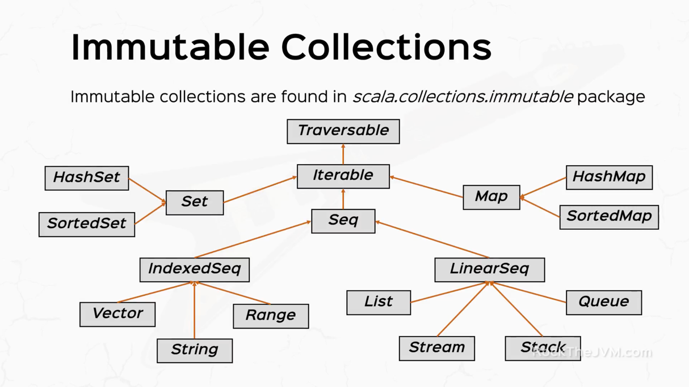
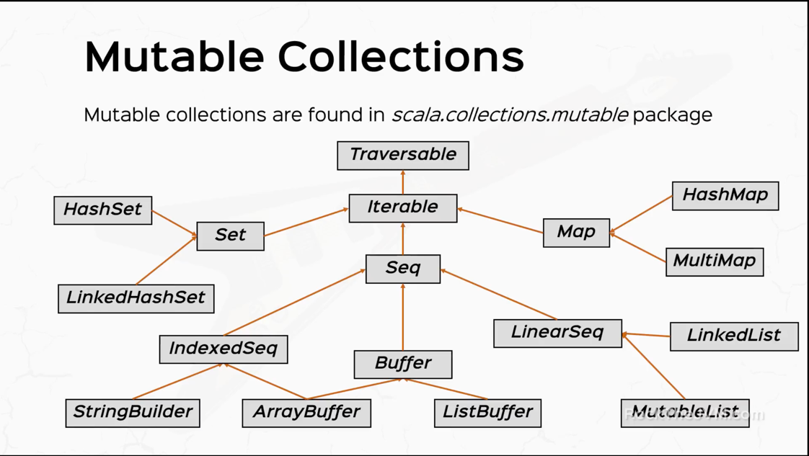

# Collections

## Immutable Collections

***Immutable collections*** are found in `scala.collections.immutable` package

## Collection Hierarchy



### Scala offers both mutable and immutable collections:
- **Mutable** collections can be updated in place; **immutables** can never change 
- Scala standard library has type definitions/type aliases for **immutable** collections

### Immutable collections are found in scala.collections.immutable
- The head abstract class is ***Traversable***, which is extended by ***Iterable***
- ***Iterable*** is extended by ***Set***: ***HashSet*** & ***SortedSet***, ***Seq***, ***Map***: ***HashMap*** and ***SortedMap***
- ***Seq*** is a type of collection that can be traversed in a set order; e.g ***IndexedSeq*** and ***LinearSeq***

### ***IndexedSeq*** and ***LinearSeq***
- ***IndexSeq*** have properties that their elements can be accessed by index, hence *O(1)* search time
- ***LinearSeq*** only guarantee in some form of ordering of elements; e.g ***stacks*** and ***queues*** have *FIFO* or *LIFO*

## Mutable Collections

***Mutable collections*** are found in `scala.collections.mutable` package

## Mutable Hierarchy



## Traversable

Base trait for all collections. Offers a great variety of methods:
```
- maps       : map, flatMap, collect
- conversions: toArray, toList, toSeq
- size info  : isEmpty, size, nonEmpty
- tests      : exists, forall
- folds      : foldLeft, foldRight, reduceLeft, reduceRight
- retrieval  : head, find, tail
```


